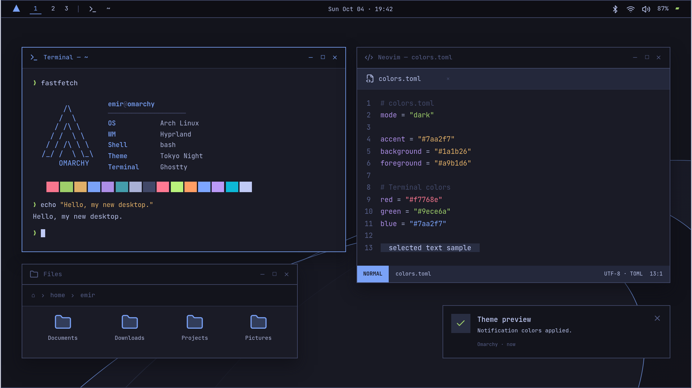

# Omarchy Theme Editor

[English](README.md) | **Türkçe**

İngilizce (varsayılan) ve Türkçe arayüzü olan, tarayıcı içinde çalışan bir Omarchy tema editörü. React + TypeScript + Vite kullanır. Sunucu, hesap veya bulut depolama gerektirmez.

Omarchy’yi çok seviyorum; bu projeyi kendi temalarımı kolayca hazırlamak ve Omarchy topluluğuyla paylaşmak için yaptım. ❤️



Ekran görüntüsü yalnızca uygulamadaki masaüstü önizlemesini gösterir. Bu, gerçek masaüstünün ekran görüntüsü değil, temayı denemek için tarayıcıda oluşturulmuş bir temsildir.

## Çalıştırma

Node.js 22.12+ (veya Vite'ın desteklediği daha yeni bir sürüm) ile:

```sh
git clone https://github.com/c0detnr/omarchy-theme-editor.git
cd omarchy-theme-editor
npm ci
npm run dev
```

Terminalde gösterilen adresi açın. Üretim çıktısı:

```sh
npm run build
npm run preview
```

`dist/` herhangi bir statik sunucuda barındırılabilir. Fontlar uygulamayla birlikte sunulur; çalışma sırasında harici font veya görsel isteği yapılmaz.

## Kullanım

- Arayüz dili varsayılan olarak İngilizcedir. Dil menüsünden Türkçe seçilebilir; tercih yerel olarak saklanır.
- Tokyo Night ile başlar. Catppuccin Latte, Nord, Gruvbox ve Rose Pine başlangıç paletleri yerel TOML dosyalarından yüklenir.
- Renk kutusuna tıklayarak özel renk panelini açın. Renk alanı ve ton şeridini sürükleyin, tema paletinden bir renk seçin veya `#RRGGBB` girin. Paneldeki **Başlangıç** düğmesi açılıştaki renge döner; Escape veya dışarı tıklama paneli kapatır. Klavyede ok tuşları renk ayarını değiştirir. Eksik/hatalı HEX, son geçerli rengi değiştirmez. Yüzey, metin ve terminal renkleri ayrıntılı bölümlerdedir.
- Açık/koyu mod sadece `mode` bilgisini değiştirir; renkleri tersine çevirmez. Omarchy'nin mevcut Rose Pine başlangıç paleti açık renkler kullanır.
- PNG, JPEG veya WebP dosyalarını ekleyin. Bir dosyayı seçebilir, kaldırabilir veya yalnızca tema rengini kullanabilirsiniz. Görsellerin özgün baytları korunur.
- Yaru ikon setleri dosya yöneticisinde temsili olarak gösterilir; gerçek ikon dosyaları tarayıcı önizlemesine yüklenmez.
- Geri al/ileri al düğmelerini veya `Ctrl/Cmd+Z`, `Ctrl/Cmd+Shift+Z` ve `Ctrl/Cmd+Y` kullanın. Metin alanlarında tarayıcının kendi metin geçmişi çalışır. Tema geçmişi son 60 değişikliği tutar.
- Dar ekranlarda **Düzenle / Önizle** düğmeleri çalışma panellerini değiştirir.
- Son çalışma, mod, ikon seçimi ve arka plan Blob'ları IndexedDB'ye otomatik kaydedilir. Kayıt başarısız olsa da düzenleme ve indirme çalışır; durum panelde görünür. Sekmeler arasında eşzamanlı değişiklik birleştirme yapılmaz.

## İçe aktarma

Tek `.toml` veya kökte / tek klasör derinliğinde bir `colors.toml` içeren `.zip` kabul edilir. TOML, **smol-toml** ile ayrıştırılır. Anlamsal renklerin yanında `color0…color15`, `bg/fg` ve diğer eski kısa adlar, Omarchy çözümleyicisinin öncelik ve ton üretme kurallarıyla dönüştürülür. Gerekli temel alanlar: `accent`, `background`, `foreground`, `red`, `green`, `yellow`, `blue`, `magenta`, `cyan` (eski karşılıkları da kabul edilir).

ZIP'ten `colors.toml`, `icons.theme` ve `backgrounds/` altındaki desteklenen görseller alınır. Diğer dosyalar ve tanınmayan renk alanları raporda listelenir, çıktıya aktarılmaz. Desteklenmeyen ikon setleri uyarıyla varsayılana döner. Bozuk TOML, geçersiz renk, eksik temel alan veya bozuk görsel mevcut çalışmayı değiştirmez.

ZIP açılmış içeriği **100 MiB**, ZIP dosyası **100 MiB**, TOML **1 MiB**, ZIP girdi sayısı **4096** ile sınırlıdır. Yüklenen arka planların toplamı **99 MiB** olabilir. Yol taşması, mutlak yollar, yinelenen girdiler, şifreli arşivler, hatalı CRC32 ve tutarsız dosya kayıtları reddedilir. Klasik ZIP'in stored/deflate yöntemleri desteklenir; ZIP64 ve çok parçalı arşivler desteklenmez. Büyük arşivler parça parça açılır; saklanmayacak dosyalar da boyut hesabına katılır.

## Dışa aktarma

**colors.toml indir**: Renkler ve mod ile, editörün tekrar okuyabileceği tema adı/slug/ikon bilgilerini içeren bir JSON yorum satırı. Omarchy bu yorum satırını yok sayar. TOML görsel içermez; bütün tema için ZIP kullanın.

**Tema ZIP indir**:

```text
<tema-slug>/
  colors.toml
  icons.theme
  backgrounds/  # Eklenen özgün görseller, varsa
```

JSON yorum satırı ayrıca seçilen arka planı korur. `icons.theme` gerçek ikon tercihini taşır. ZIP yeniden içe aktarıldığında renkler, mod, ikon, arka plan seçimi ve görsel baytları korunur.

Klasör adı `[a-z0-9_][a-z0-9._+-]*` biçiminde, en fazla 100 karakter olmalıdır. Görünen tema adı Türkçe olabilir; klasör adı otomatik oluşturulur ve dışa aktarma penceresinde ayrıca düzenlenebilir. Tema klasörünü `~/.config/omarchy/themes/` içine yerleştirin ve Omarchy tema menüsünden seçin. Omarchy uygulama ayarlarını bu paletten üretir.

## Doğrulama

```sh
npm run typecheck
npm test
npm run test:e2e
npm run build
```

Tarayıcı testleri sistem Chromium'unu `/usr/bin/chromium` konumunda kullanır. Farklı bir konum için `CHROMIUM_PATH=/path/to/chromium npm run test:e2e` çalıştırın. E2E sunucusu 5174 portunu kullanır. Testler canlı renk değişimini, geçersiz HEX'i, klavye geçmişini, presetleri, ikonları, pencere menüsünü, arka plan yükleme/kaldırmayı, yenileme sonrası geri yüklemeyi, içe/dışa aktarmayı, hata halinde çalışmanın korunmasını ve mobil oranı denetler. Görsel kontrol için ekran görüntüleri `artifacts/` altında üretilir.

## Yapı ve kaynaklar

- `src/theme/model.ts`: belge, palet, slug ve boyut kuralları.
- `src/theme/resolve.ts`: Omarchy renk çözümleme ve eski ad dönüşümü.
- `src/theme/io.ts`, `zip.ts`, `images.ts`: arayüzden bağımsız dosya işlemleri.
- `src/theme/storage.ts`, `history.ts`, `useEditor.ts`: kalıcılık ve değişiklik geçmişi.
- `src/components/`: renk alanları, arka planlar ve CSS değişkenleriyle tema kullanan masaüstü.
- `src/theme/palettes/`: resmî Omarchy `quattro` dalından alınan başlangıç paletleri (4 Ekim 2026).

Uyumluluk [Omarchy tema dokümantasyonu](https://omarchy.org/manual/making-your-own-theme/) ve [güncel renk çözümleyicisine](https://github.com/omacom/omarchy/blob/quattro/bin/omarchy-theme-color) dayanır. Palet kaynakları [Omarchy themes](https://github.com/omacom/omarchy/tree/quattro/themes) altındadır. [React](https://react.dev/learn), [Vite](https://vite.dev/guide/), [fflate](https://github.com/101arrowz/fflate), [smol-toml](https://github.com/squirrelchat/smol-toml).

Gerçek sisteme uygulama, GitHub URL'sinden içe aktarma, `shell.toml` stil düzenleme, hesap ve bulut depolama bu sürümün kapsamı dışındadır. Uygulama yerel sistem ayarlarını değiştirmez.
